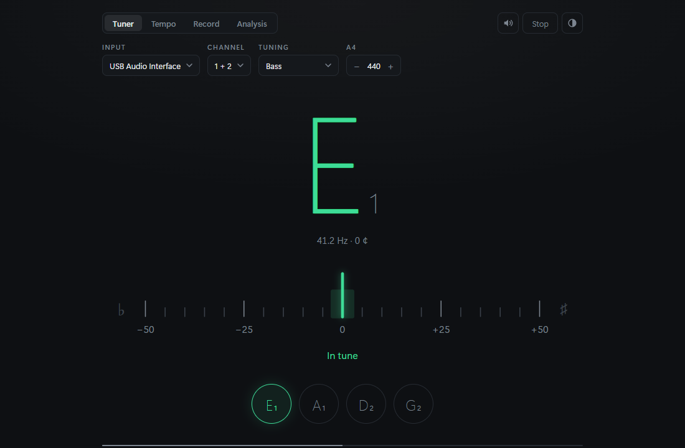
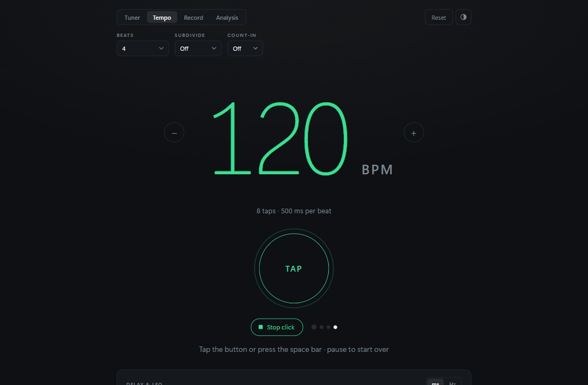
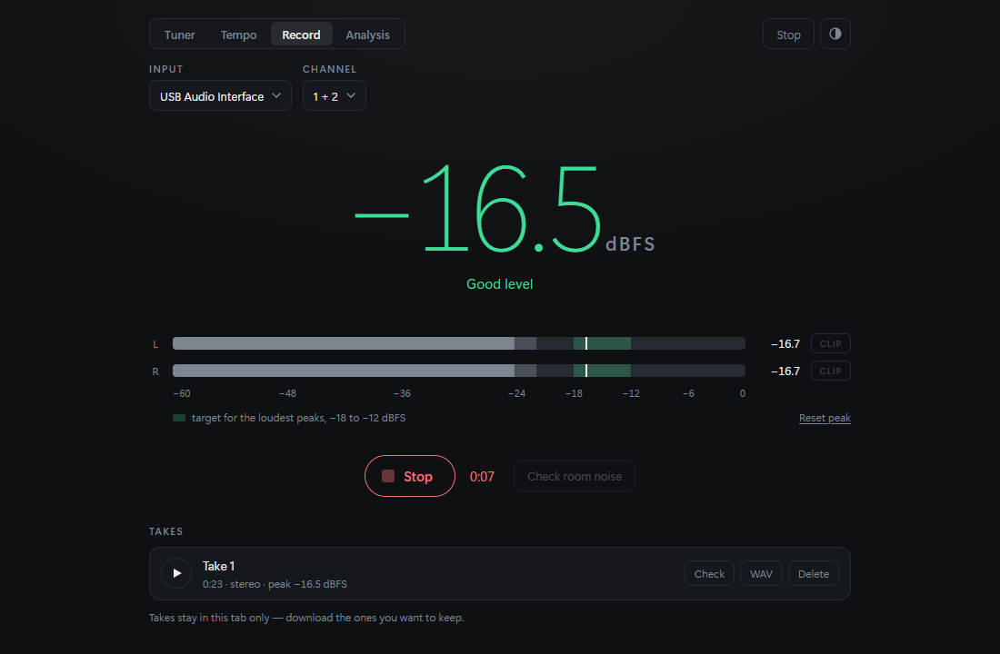
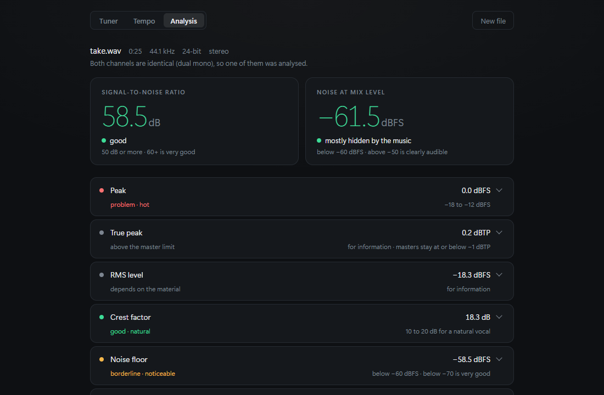
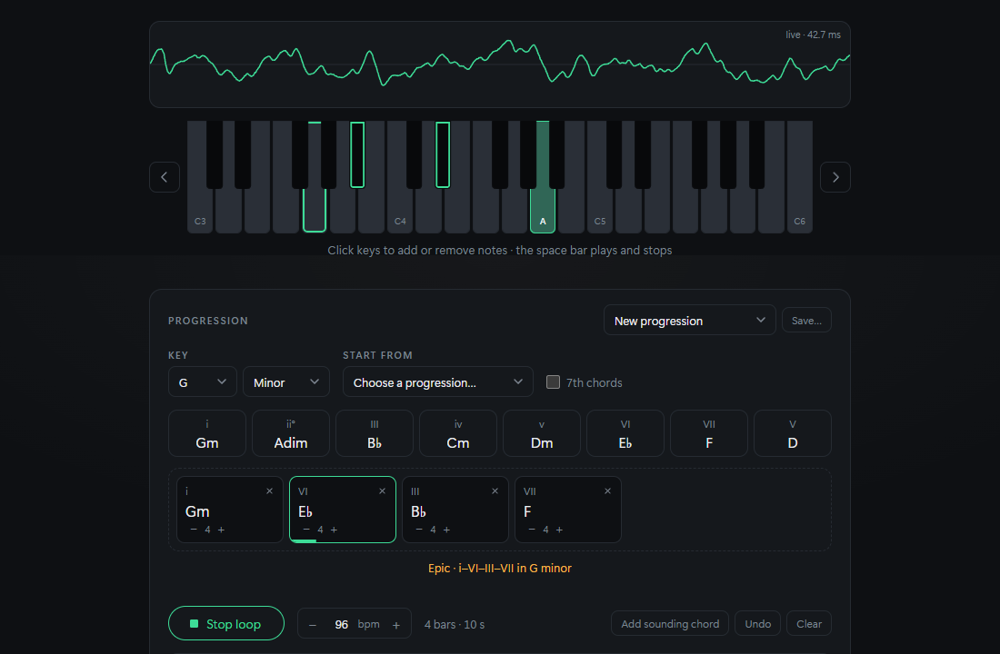

# DAW Helper

A small, clean toolbox for home recording that runs in your browser and talks
directly to your audio interface. No dependencies, no build step, no account.

Today it does five things well:

| Tuner | Tempo |
| --- | --- |
|  |  |
| Chromatic tuner for guitar, 12-string, bass, ukulele, banjo, mandolin, the violin family and your own tunings, accurate to well under a cent, with reference tones | Tap tempo, a metronome with accents, subdivisions and count-in, and delay/LFO times |
| **Record** | **Analysis** |
|  |  |
| A gain-staging meter, a room-noise check and a quick recorder that saves WAV files and hands takes to the analysis | Drop a vocal take and get its levels, noise, clipping, plosives and hum explained in plain words |
| **Sound lab** | |
|  | |
| Play tones in Hz and chords in 23 synthesised sounds, learn what makes them tick, and sketch chord progressions with bass and drums, exported as WAV, stems or MIDI | |

## Getting started

You need [Node.js](https://nodejs.org) 18 or newer and a Chromium-based browser
(Chrome, Edge) or Firefox.

```
git clone https://github.com/SaschaLurz/daw-helper.git
cd daw-helper
npm start
```

`npm start` serves the app on <http://localhost:4321> and opens it in your
browser. (Browsers only allow audio-input access from a secure context; a
local server on `localhost` counts as one, which is why there is one.)

Once it has loaded, the app also works offline, and Chrome and Edge offer to
install it (the install icon in the address bar), after which it opens in its
own window like any other app. It follows your system's light or dark setting;
the round button at the right of the top bar switches between following the
system, light and dark.

## Tuner

1. Click **Start listening** and allow microphone access.
2. Pick your audio interface in the **Input** menu — the choice is remembered.
3. Play a string.

The big note tells you what it hears, the meter shows how far off you are in
cents, and everything turns green when you are within ±3 ¢. The string you are
playing lights up in the row at the bottom; if a string is far off (say it reads
D2 while you're aiming for E2) the hint says *Tune up ↑ to E2*.

- **Channel** appears when the interface opens in stereo. Choose input 1 or 2
  if only one of them has the guitar plugged in, so noise on the other input
  can't interfere.
- **Tuning** picks the instrument and its tuning:
  - Guitar: Standard, Drop D, E♭ Standard, D Standard, Drop C, DADGAD, Open G,
    Open D, Open E, Open C, 7-string, 8-string, baritone
  - 12-string: standard, and a whole step down
  - Bass: EADG, Drop D, E♭, BEAD, 5-string, 6-string
  - Ukulele: GCEA (high G), low G, D tuning, baritone, guitalele
  - Banjo: 5-string in open G, double C and open D, tenor, Irish tenor, plectrum
  - Mandolin family: mandolin, mandola, octave mandolin, mandocello
  - Violin family: violin, viola, cello, double bass
  - Other: dobro in open G, lap steel C6, Irish and Greek bouzouki
- **Custom tunings** cover everything else. Pick **New custom tuning…** at the
  bottom of the menu, name it, and type the strings as notes, lowest first:
  `D2 A2 D3 F#3 A3 D4`. Sharps and flats go in as `F#3` or `Bb1` (a tuning
  written with flats is also shown with flats), and strings that share a course
  are joined with a slash: `E2/E3`. The editor starts from the current tuning
  and checks every note as you type. Custom tunings are remembered in this
  browser; the pencil next to the menu edits or deletes the selected one.
- **Courses.** On a 12-string (or a Greek bouzouki) each course shows its
  octave string as a smaller button under the main one, and the tuner knows
  both. Tune them one string at a time: when both strings of a pair ring
  together, the tuner hears the lower one.
- **A4** sets the reference pitch (415–466 Hz).
- **Click a string** to lock the tuner to it, which helps when a string is a
  long way off or you're fitting new strings. Click again or press Escape to
  go back to automatic.
- **Reference tone** — the speaker button — makes the strings audible: click
  one and its note plays until you click it again (or press Escape), at the
  current A4. Use it to tune by ear, or just to check that sound comes out of
  the right speakers. It works without starting the tuner; with the tuner
  listening as well, the meter shows how close you are while you hear the
  note. The tone is a soft sound with a few overtones, so even a low E is
  audible on small speakers.
- The thin bar at the very bottom is the input level, so you can see the
  signal arriving and set the gain on your interface sensibly.

Under the hood the browser's own audio processing (echo cancellation, noise
suppression, automatic gain) is switched off, since it wrecks pitch tracking.
The signal passes a high-pass and a 2.2 kHz low-pass and is analysed every
20 ms with the [McLeod Pitch Method](https://www.cs.otago.ac.nz/tartini/papers/A_Smarter_Way_to_Find_Pitch.pdf),
which copes well with strong harmonics without octave errors. A short median
filter keeps the reading from jittering.

Low strings are where many tuners give up: a bass's low E sits at 41 Hz, a
five-string's low B at 31 Hz, and from a bass pickup the fundamental is often
weaker than the octave above it. So the detector adapts to the tuning. It
looks at a window of at least four cycles of the lowest string (170 ms for
bass, 85 ms for guitar), searches down to three quarters of that string's
frequency, and the high-pass drops from 35 Hz to below the lowest string. The
autocorrelation behind the method is computed with an FFT, which keeps even
the long bass window at about a millisecond of work per reading.

## Tempo

Switch to **Tempo** in the top bar and tap along to the beat: click the button,
tap it on a touch screen, or press the space bar. The BPM updates on every tap
and turns green once your taps are steady. A ring keeps pulsing at the detected
tempo after you stop, so you can check it against the music.

Pause for a couple of seconds (or press **Reset**) to start a fresh
measurement. Stray taps well off the beat are ignored, and if you drift to a
different tempo without pausing the reading follows within a few taps.

You can also set the tempo directly: click the number and type one (20–300,
decimals such as `98.5` or `98,5` are fine), use **−** and **+**, or the arrow
keys while the number is selected (Shift for steps of 10). The tempo is
remembered.

**Start click** plays a metronome at that tempo, and the dots next to it show
where you are in the bar. In the top bar:

- **Beats** — beats per bar; the first one is accented. 1 means no accent.
- **Subdivide** — quieter clicks between the beats: eighths, triplets or
  sixteenths.
- **Count-in** — one or two bars of plain beats before the pattern starts,
  counted down under the number.

Changes, including tapping a new tempo, take effect from the next beat without
stopping the click. The clicks are scheduled on the audio clock a little ahead
of time, so they stay steady while the page is busy, and they keep going in a
background tab (for example while your DAW is in front). The click plays
through your system's default output.

**Delay & LFO** below lists the length of each note value at the current tempo
— straight, dotted and triplet, from whole notes to 1/32 — in milliseconds for
delay times, reverb pre-delay or compressor release, or in Hz for LFO rates.

Tempo mode does not need microphone access.

## Record

Switch to **Record**, click **Start listening** and pick your interface. The
input and channel are shared with the tuner.

**Setting the gain.** Play or sing the loudest part of the song. The big number
is the loudest peak since you last pressed **Reset peak**, and the line under it
says what to do: turn up, turn down, or leave it. The target for the loudest
peaks is −18 to −12 dBFS (the green zone on the meter), the same target the
Analysis report uses; below −24 the recording will be noisier than it needs to
be, above −6 a louder moment may clip. The meter shows each input channel: the
bright bar is the RMS level over 300 ms, the paler bar the peak, which falls
back at 20 dB per second, and the white mark the peak hold. **Clip** lights up
when a sample reaches full scale and stays lit until you click it (or reset the
peak). The meter sees every sample, because it runs in an AudioWorklet next to
the audio rather than at the screen's frame rate, so no peak slips through.

**Recording.** **Record** captures the input exactly as it arrives (both
channels when **Channel** is 1 + 2, otherwise the one you picked) for up to ten
minutes. Every take gets a row: play it, save it as a 24-bit **WAV**, **Check**
it (which opens it in Analysis as if you had dropped the file there), or
delete it. Takes live in memory in this tab only, so download the ones you
want to keep. They are recorded at the rate the browser runs its audio at,
usually 48 kHz.

**Check room noise** records five seconds of silence at the current gain
(don't play or touch anything) and reports the noise floor, any 50 or 60 Hz
mains hum, and the signal-to-noise ratio you will get: from the loudest peak
measured before the check, or assuming peaks at −12 dBFS if you haven't played
yet. The first half second is skipped, so the click that started the check
doesn't count.

## Analysis

Switch to **Analysis** and drop a recording onto the page (or click **Choose a
file**, or press **Check** on a take in Record mode). WAV, MP3, FLAC and M4A work; nothing is uploaded — the file is decoded
and measured in your browser, in a Web Worker so the page stays responsive.
Files longer than five minutes are cut to the first five.

The report is written for people new to home recording. At the top sit the two
numbers that matter most:

- **Signal-to-noise ratio** — peak level minus noise floor. Under 40 dB is a
  problem, 40–50 borderline, 50–60 good, above 60 very good.
- **Noise at mix level** — where the background noise ends up once the take is
  turned up to normal mix level (peaks at −3 dBFS). Above −50 dBFS it is clearly
  audible; that is usually the number that makes the problem click.

Below them, one card per measurement, each with the value, the target range, a
colour-coded status and — on click — an explanation of what the number means,
what too high or too low points at, and what to do about it:

peak · true peak (4× oversampled) · RMS · crest factor · noise floor (5th
percentile of 200 ms blocks, digital silence left out) · integrated loudness
(ITU-R BS.1770-4, K-weighted and gated) · clipping (three or more full-scale
samples in a row) · dropouts (runs of exact zeros, and isolated jumps a smooth
waveform can't produce) · DC offset · rumble below 40 Hz · plosives · sibilance
(5–9 kHz against the whole signal) · mains hum (50 or 60 Hz and harmonics,
measured in the quiet passages) · spectral balance in nine bands · pitch range
and steadiness, using the tuner's detector, shown only when the material is
clearly tonal.

Clipping, dropouts, plosives and sibilance come with timestamps; click one to
hear three seconds around it. The summary at the bottom turns the statuses into
a short, prioritised list of things to do — clipping first, then dropouts, then
noise and level, then the rest — or says plainly that there is nothing to fix.

A few honest limits: the tool measures, it does not diagnose. It cannot tell
whether noise comes from the room, the preamp or the microphone, or whether
low-frequency energy is a plosive or a low note, and values such as crest
factor, loudness and spectral balance depend heavily on what was sung. The
texts say so. Technically: the native sample rate is read from the file header
and decoding happens at that rate, because `decodeAudioData` would otherwise
resample; identical stereo channels (dual mono) and stereo files with one empty
side are analysed as one channel, other stereo files as their mono sum; all
spectral values come from one STFT (Hann, 4096 samples, 50 % overlap), except
the hum check, which needs about 3 Hz of resolution and averages a longer FFT.

## Sound lab

Switch to **Sound lab** to play with tones: single frequencies, intervals and
chords of up to eight tones, with the names, numbers and a picture of what you
hear. Below them, sketch a song's chord progression and take it to your DAW.
It does not need microphone access.

- **Tones.** Every tone has a row. The dot switches it on and off, and the
  slider sweeps it from 20 Hz to 20 kHz (logarithmic, so every octave gets the
  same room). You can also type into its frequency: a number (`440`, `261,6`,
  `1.5k`) or a note (`A4`, `Eb2`, `F#3`). While the frequency is selected the
  arrow keys move it by 1 Hz, with Shift by 10. **−** and **+** step to the
  next note below or above, which also snaps a slid tone back onto the notes.
  The small slider on the right is the tone's level. **Add tone** adds one a
  fifth above the highest, **Transpose** moves every tone by a semitone or an
  octave, and **Clear** removes them all.
- **Keyboard.** Click a key to add its note, and again to take it away; the
  arrows show other octaves (a phone shows two octaves). The keys of the
  sounding tones light up, named as they are spelled in the chord.
- **Playing.** **Play** (or the space bar) starts and stops the tones. Loading
  a chord, clicking a key or adding a tone starts them too, and Escape stops
  everything. **Arpeggio** plays the tones one at a time, lowest first, then
  all together, lighting each key as it sounds. **Volume** is Sound lab's
  own and never changes an export. The tones together never go past full
  scale: when their levels add up to more than one, each is turned down in
  proportion, and a limiter at the end of the mix catches the rest.
- **Sounds.** **Sound** in the top bar picks what the tones play:
  - Waves: soft (the tuner's reference tone), sine, triangle, square, sawtooth
  - Keys: piano, electric piano, organ, music box
  - Guitars & strings: acoustic guitar, nylon guitar, harp, strings
  - Synths: warm pad, dream pad, supersaw, analog poly, synth pluck, glass
    bells, 8-bit
  - Bass: finger bass, synth bass, sub bass

  Everything is synthesised in the browser, so there is nothing to download
  and it works offline. The piano is built from slightly inharmonic partials
  that each die away at their own rate, the guitars, harp and finger bass are
  physically modelled plucked strings (Karplus–Strong), the electric piano and
  bells use FM, and the rest are classic subtractive synths with filter
  envelopes, detuned oscillators and a little room reverb. Every sound is
  trimmed to the same loudness, so switching between them doesn't jump in
  level. A piano or guitar dies away like the real thing: press **Play** again,
  or switch a tone off and on, to strike it again.
- **What you hear.** The big readout names it. A note comes with its frequency
  and cents. An interval comes with its size, its pure ratio and how far off
  it the tones are (a piano's fifth is 2 ¢ narrower than a pure 3:2, its major
  third 14 ¢ wider than 5:4), plus a tune that starts with it. A chord comes
  with its inversion and its notes spelled the way musicians write them: C
  minor has an E♭, D♭7 a C♭. Each row says what its tone is (root, major 3rd,
  5th …). Two tones on the same note a few Hz apart beat, and the readout says
  how often. The readout keeps its size whatever it shows, so the keyboard and
  buttons below it never move.
- **Waveform.** With a plain wave, the tones added together, drawn from the
  same maths as the sound: four cycles of the lowest tone, or two beats when
  tones beat, so the swelling shows. With an instrument, or while the loop
  plays, what actually comes out, live.
- **Chords, intervals & experiments.** Pick a root and an octave, then click a
  chord (triads, sevenths, sixths and added notes, ninths) or an interval to
  hear it, with a few words on its character. A new root or octave replays it
  there. The experiments each come with an explanation: beating (how tuning by
  ear works), a pure against a piano-tuned major third, the harmonic series,
  the missing fundamental (why a bass still sounds low on phone speakers) and
  a detuned unison, the "supersaw" of synth leads.

The tones, the sound, the volume and the root are remembered. A4 is shared
with the tuner. When it changes, tones keep their frequency, and their note
names and cents follow the new reference.

### Progression

The **Progression** card is a sketchpad for the chords of a song: lay them out
in a loop, hear them with a bass line and drums, and take the result to your
DAW as audio or MIDI.

- **Key.** Pick a key and major or minor, and the card offers that key's
  chords with their Roman numerals: I ii iii IV V vi vii° in major, and in
  minor also the major V that minor songs lean on. **7th chords** turns them
  into seventh chords. **Start from** loads a famous progression in the
  current key: pop I–V–vi–IV, 50s I–vi–IV–V, vi–IV–I–V, Pachelbel's canon,
  I–♭VII–IV–I, the royal road, jazz ii–V–I, neo-soul, the 12-bar blues, the
  Andalusian cadence, i–VI–III–VII and i–iv–V–i. Chords are stored relative to
  the key, so changing the key transposes the whole song.
- **The loop.** Drag a chord from the key's chords, or from the chord library
  further down, to where it should go in the loop, or click one to add it at
  the end. **Add sounding chord** adds whatever chord the tones above make
  (built on the keyboard, say) after the selected block. Each block shows its
  numeral and name and lasts a bar; **−** and **+** make it 1 to 8 beats long.
  Drag blocks to reorder them (on a touch screen too), click one to hear it and
  see it named and explained above, **×** removes it. From the keyboard:
  Enter plays a focused block, Delete removes it, Alt+← and Alt+→ move it.
  **Undo** (or Ctrl+Z) steps back through every change.
- **Playing.** **Play loop** plays it round and round at the tempo next to it,
  which is shared with the Tempo tab, so you can tap a song's tempo there. The
  block being heard lights up with a progress bar, and its chord shows on the
  keyboard. Everything can change while the loop plays: chords, sounds, tempo,
  parts; the change is heard from the next note, in time. You can also play the
  tones or the keyboard over it.
- **Parts.** Each part has an on/off dot and a volume:
  - Chords: their sound (any of the sounds above), a playing style (held,
    every beat, eighths, a down-down-up-up-down-up strum, arpeggio up, up and
    down) and a voicing. **Smooth** voice-leads: each chord takes the
    inversion that moves the fewest semitones from the one before, as a
    pianist would play it. **Root position** plays every chord from its root.
  - Bass: its sound and pattern (held roots, every beat, eighths, root and
    fifth, octaves), in a bass guitar's first octave, E1 to D♯2. Switch it off
    to play the bass line yourself.
  - Drums: click, pop, rock, half-time ballad, hip-hop or four on the floor.
- **Export.** Pick how many times round (1, 2, 4 or 8), then:
  - **WAV**: the mix as a 24-bit, 48 kHz stereo file. It loops seamlessly:
    it starts with the tail the last chord leaves when the loop comes round,
    so it can go straight onto a looping clip.
  - **Stems**: one WAV per part (chords, bass, drums), lined up, in a ZIP.
  - **MIDI**: a tempo track and one track per part, with each sound's General
    MIDI instrument and the drums on channel 10, ready to put on your own
    instruments in the DAW.

  Parts that are switched off are left out. The audio is rendered offline in
  the browser from the same sounds you hear, which takes a few seconds.
- **Saving.** **Save…** stores the progression under a name in this browser:
  its key, chords, tempo, sounds and parts. The menu next to it opens a saved
  one, or starts a new progression in the same key and sounds; saving an open
  one updates it, **Save as new** keeps both.

## Project layout

```
index.html            page structure
style.css             all styling (dark and light theme, single accent colour)
app.js                audio setup, device handling, rendering, reference tone, tempo UI and
                      metronome sound, Record mode, file loading and the report, Sound lab
pitch.js              pitch detection (McLeod Pitch Method) and note maths
tunings.js            the instruments and their tunings, and the note notation custom tunings use
tempo.js              tap-tempo estimation, note lengths, typed-tempo parsing
metronome.js          the metronome's timing: beats, accents, subdivisions, count-in
analysis.js           file-header sniffing, FFT/STFT and every measurement of the analysis
analysis-worker.js    runs analysis.js off the main thread
report.js             statuses, target ranges, explanations and the summary of the analysis
recorder.js           meter ballistics, level advice, WAV encoding, room-noise verdict
recorder-worklet.js   AudioWorklet that meters every sample and captures takes
tones.js              Sound lab's maths: intervals, chord names and spelling, experiments, waves
instruments.js        Sound lab's synthesised sounds and drums, the mix, and offline rendering
song.js               progressions: keys and numerals, voicing, styles, bass, drums, MIDI and ZIP
sw.js                 service worker: offline support (network first, cache as fallback)
manifest.webmanifest  install metadata; icons/ holds the app icons
serve.js              dependency-free static server for local use
test/                 unit tests for the scripts above, plus a check that sw.js caches every file
docs/                 screenshots
```

`pitch.js`, `tunings.js`, `tempo.js`, `metronome.js`, `analysis.js`, `report.js`,
`recorder.js`, `tones.js`, `instruments.js` and `song.js` are plain scripts that also
work under `require()`, which is how the tests load them. When the page starts loading a new file, add it to the
`FILES` list in `sw.js` (the tests fail until you do).

## Tests

```
npm test
```

The pitch tests run the detector against synthetic guitar tones (open strings,
detuned strings, dominant second harmonics, noise, DC offset), the ukulele and
mandolin range, and bass notes from low B to high C with a weak fundamental,
stiff-string overtones, decay and noise, and check it stays within half a cent
and that a low E never reads as E2 — across the whole range custom tunings may
use, A0 to E6. The tunings tests check the note notation and its error
messages, that every preset is valid and uniquely named, and that tunings which
existed before keep their ids and notes. The tempo tests feed
simulated tap sequences: steady beats, human jitter, mis-taps, pauses, tempo
changes and bounced double events, and check the note lengths and typed-tempo
parsing. The metronome tests check tick times, accents, subdivisions, count-in
and that changes mid-bar keep every beat on the grid. The
analysis tests parse hand-built WAV, FLAC, MP3 and M4A headers, check the
K-weighting filter against the coefficients in BS.1770 and a −20 dBFS sine
against −23 LUFS, and run synthetic takes with known noise, clipping, gaps,
jumps, rumble, plosives, sibilance and 50/60 Hz hum through every measurement.
The report tests cover the thresholds and the ordering of the advice. The
recorder tests check the meter's ballistics, the level advice, that WAV files
round-trip sample for sample and parse with the analysis's own header reader,
and the room-noise verdict on synthetic hiss, hum and silence. The tones tests
check that chords are named through voicings, doublings and inversions, and
every chord on every root as itself; the spelling (C♭ where it belongs, no
double flats); interval sizes against their pure ratios; typed frequencies and
notes; stepping between notes; the slider scale; beating; the experiments; the
wave shapes; and that the mix never exceeds full scale. The instruments tests
build every sound at a low, middle and high pitch against a strict stand-in
for the Web Audio API that rejects NaN values, missing starts and unfinished
notes, check that every note stops after its release, and run the plucked
string through the tuner's own pitch detector: it must ring within 3 cents of
its pitch and die away. The song tests check keys and Roman numerals, every
famous progression against its name, textbook voice leading (C–G–Am–F as C E
G → B D G → C E A → C F A), every playing style staying inside its block, bass
patterns and drum grooves, a MIDI file read back byte by byte, a ZIP with a
known checksum, and that stored loops and songs are repaired rather than
trusted.

## Ideas for what to build next

The aim is a toolbox for the small jobs around a home recording session — the
things you'd otherwise open a phone app or a calculator for. Some candidates,
roughly in the order they'd be useful:

**Tempo and timing**

- **Tempo from audio** — detect the tempo of a loop or a recording via onset
  detection, instead of tapping.

**Tuning and pitch**

- **Intonation helper** — compare the open string with the 12th-fret reading
  per string and say which way to move the saddle.

**Levels and signal**

- **Round-trip latency test** — send a click out of the interface, capture it
  on the input, and report the latency in milliseconds and samples for setting
  the DAW's compensation.
- **Spectrum analyser** — a real-time view of what is coming in.

**Studio utilities**

- **Test signal generator** — pink and white noise and sweeps, next to Sound
  lab's steady tones — for checking headphones, monitors and the room.
- **Frequency cheat sheet** — instrument ranges, EQ trouble spots and a
  note ↔ Hz ↔ MIDI converter.
- **Session notes** — BPM, key, tuning and capo per song, saved locally.

**The app itself**

- **Output choice** — pick which output the metronome and reference tone play
  through, rather than the system default (Chrome and Edge support this;
  other browsers would keep the default).

Ideas, bug reports and pull requests are welcome via
[issues](https://github.com/SaschaLurz/daw-helper/issues).
